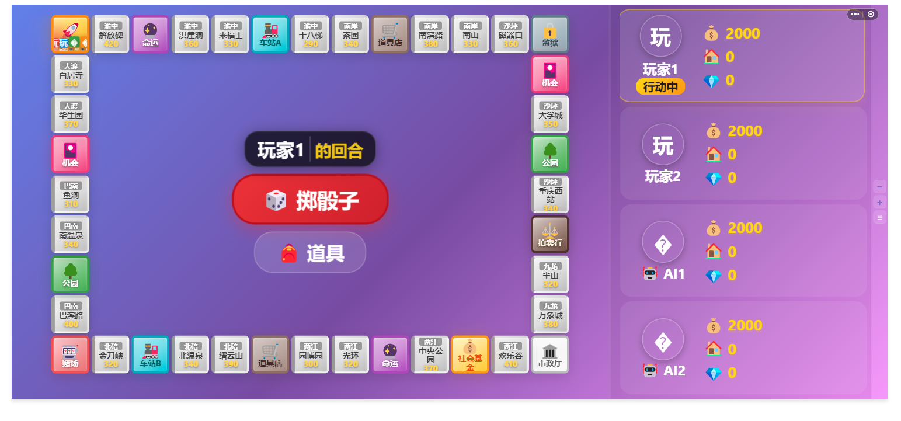

# Player Character System Implementation Plan

> **For agentic workers:** REQUIRED SUB-SKILL: Use superpowers:subagent-driven-development (recommended) or superpowers:executing-plans to implement this plan task-by-task. Steps use checkbox (`- [ ]`) syntax for tracking.

**Goal:** Replace simple player dots with a complete character system featuring avatars, names, status indicators, and smooth animations, all while maintaining perfect screen adaptation through a tile-embedded approach.

**Architecture:** Transform the current dot-based player display (`.players-dot > .player-dot`) into a full character system (`.tile-players-container > .player-character`) that lives inside each tile. Characters will include avatar icons, name labels, status badges (jail/skip), and CSS animations (bounce on move, pulse on current turn). Data preparation happens in `game.js` updateData() to build a `playersMap` and enhance tile data with player counts.

**Tech Stack:** WeChat Mini Program (WXML, WXSS, JavaScript), CSS Animations, Flexbox Layout

---

## File Structure Map

**Files to modify:**
- `miniprogram/pages/game/game.wxml` - Replace player dots with character components
- `miniprogram/pages/game/game.wxss` - Add character styles and animations
- `miniprogram/pages/game/game.js` - Enhance data preparation in updateData()

**No new files to create** - This is a focused enhancement of existing game page components.

---

### Task 1: Update Data Layer - Prepare Player Information

**Files:**
- Modify: `miniprogram/pages/game/game.js:200-349` (updateData function)

- [ ] **Step 1: Add playersMap construction after ownerColors calculation**

Find the section where `playerColorMap` is built (around line 247) and add after it:

```javascript
const playersMap = {};
for (var pi = 0; pi < state.players.length; pi++) {
  var p = state.players[pi];
  playersMap[p.id] = {
    id: p.id,
    name: p.name,
    avatar: (p.icon || p.name.charAt(0) || '?').substring(0, 2),
    color: (p.color && p.color.primary) || '#999',
    isMoving: p.isMoving || false,
    inJail: p.inJail || false,
    skipNextTurn: p.skipNextTurn || false,
    bankrupt: p.bankrupt || false
  };
}
```

- [ ] **Step 2: Enhance processedMapTiles with player count**

Inside the `processedMapTiles.map()` callback, after the existing `t.playerIds.push(...)` logic, add:

```javascript
t.playerCount = t.playerIds.length;
```

- [ ] **Step 3: Add new data fields to setData call**

In the `this.setData({...})` call at the end of updateData, add:

```javascript
playersMap: playersMap,
currentPlayerId: state.currentPlayerIndex
```

- [ ] **Step 4: Verify data structure**

Add temporary console.log before setData to verify:

```javascript
console.log('[DEBUG] playersMap:', JSON.stringify(playersMap));
console.log('[DEBUG] Sample tile players:', processedMapTiles[0].playerIds, 'count:', processedMapTiles[0].playerCount);
```

Expected output: playersMap contains all player details, tiles have correct playerCount.

- [ ] **Step 5: Remove debug logs**

Remove the console.log statements added in Step 4 once verified working.

Run: Test in WeChat DevTools, open game page, check console for playersMap data.

---

### Task 2: Update WXML Template - Character Structure

**Files:**
- Modify: `miniprogram/pages/game/game.wxml:15-25` (inside tile loop)

- [ ] **Step 1: Replace players-dot block with new structure**

Find and replace the entire `<view class="players-dot">...</view>` block with:

```xml
<view class="tile-players-container" data-player-count="{{item.playerCount}}">
  <block wx:for="{{item.playerIds}}" wx:for-item="pid" wx:key="*this">
    <view class="player-character 
                {{playersMap[pid].isMoving ? 'is-moving' : ''}}
                {{currentPlayerId === pid ? 'current-turn' : ''}}
                {{playersMap[pid].inJail ? 'in-jail' : ''}}
                {{playersMap[pid].skipNextTurn ? 'skip-turn' : ''}}"
          style="--player-color: {{playerColorMap[pid]}};">
      
      <view wx:if="{{playersMap[pid].inJail || playersMap[pid].skipNextTurn}}" 
            class="status-badge">
        <text class="status-icon">{{playersMap[pid].inJail ? '🔒' : '⏭️'}}</text>
      </view>
      
      <view class="char-body">
        <text class="char-avatar">{{playersMap[pid].avatar}}</text>
      </view>
      
      <text wx:if="{{item.playerCount <= 2}}" class="char-name">{{playersMap[pid].name}}</text>
    </view>
  </block>
</view>
```

- [ ] **Step 2: Verify template syntax**

Check for proper closing tags, correct wx:for usage, and conditional rendering.

Run: Compile in WeChat DevTools, check for WXML compilation errors.

---

### Task 3: Base Character Styles - Container & Body

**Files:**
- Modify: `miniprogram/pages/game/game.wxss` (add after existing .player-dot styles)

- [ ] **Step 1: Add tile-players-container styles**

Insert after the existing `.players-dot` styles:

```css
.tile-players-container {
  position: absolute;
  bottom: 2rpx;
  left: 50%;
  transform: translateX(-50%);
  display: flex;
  flex-direction: row;
  align-items: flex-end;
  justify-content: center;
  gap: 2rpx;
  z-index: 10;
  pointer-events: none;
}
```

- [ ] **Step 2: Add player-character base styles**

```css
.player-character {
  display: flex;
  flex-direction: column;
  align-items: center;
  position: relative;
  transition: all 0.3s ease;
}

.tile-players-container[data-player-count="1"] .player-character {
  width: 32rpx;
}

.tile-players-container[data-player-count="2"] .player-character,
.tile-players-container[data-player-count="3"] .player-character,
.tile-players-container[data-player-count="4"] .player-character {
  width: 22rpx;
}
```

- [ ] **Step 3: Add char-body styles**

```css
.char-body {
  width: 100%;
  height: 26rpx;
  border-radius: 6rpx;
  background: var(--player-color);
  display: flex;
  align-items: center;
  justify-content: center;
  box-shadow: 0 2rpx 6rpx rgba(0,0,0,0.3);
  transition: all 0.3s ease;
  overflow: hidden;
}
```

- [ ] **Step 4: Add char-avatar and char-name styles**

```css
.char-avatar {
  font-size: 13rpx;
  color: white;
  font-weight: bold;
  line-height: 1;
}

.char-name {
  font-size: 8rpx;
  color: #333;
  text-align: center;
  max-width: 100%;
  overflow: hidden;
  text-overflow: ellipsis;
  white-space: nowrap;
  margin-top: 1rpx;
  line-height: 1;
}
```

Run: Refresh in DevTools, verify characters appear inside tiles with correct styling.

---

### Task 4: Status Badge Styles - Jail & Skip Indicators

**Files:**
- Modify: `miniprogram/pages/game/game.wxss` (continue from Task 3)

- [ ] **Step 1: Add status-badge container styles**

```css
.status-badge {
  position: absolute;
  top: -12rpx;
  right: -8rpx;
  z-index: 20;
  background: rgba(0, 0, 0, 0.75);
  border-radius: 50%;
  width: 18rpx;
  height: 18rpx;
  display: flex;
  align-items: center;
  justify-content: center;
  animation: statusPulse 1.5s ease-in-out infinite;
}

.status-icon {
  font-size: 10rpx;
  line-height: 1;
}
```

- [ ] **Step 2: Add statusPulse animation**

```css
@keyframes statusPulse {
  0%, 100% { 
    transform: scale(1);
    opacity: 1;
  }
  50% { 
    transform: scale(1.15);
    opacity: 0.85;
  }
}
```

- [ ] **Step 3: Add state-specific overrides for body**

```css
.player-character.in-jail .char-body,
.player-character.skip-turn .char-body {
  animation: shake 0.5s ease-in-out infinite;
  opacity: 0.7;
}

@keyframes shake {
  0%, 100% { transform: translateX(0); }
  25% { transform: translateX(-2rpx); }
  75% { transform: translateX(2rpx); }
}
```

Run: Test by placing a player in jail state, verify badge appears with shake animation.

---

### Task 5: Movement Animation - Bounce Effect

**Files:**
- Modify: `miniprogram/pages/game/game.wxss` (continue from Task 4)

- [ ] **Step 1: Add is-moving bounce animation**

```css
.player-character.is-moving .char-body {
  animation: charBounce 0.5s ease-in-out infinite;
}

@keyframes charBounce {
  0%, 100% { 
    transform: translateY(0) scale(1); 
  }
  50% { 
    transform: translateY(-8rpx) scale(1.12); 
  }
}
```

- [ ] **Step 2: Ensure gameState sets isMoving flag correctly**

Verify in `miniprogram/utils/gameState.js` around line 379 that `player.isMoving = true` is set at start of movePlayer and `player.isMoving = false` at end (around line 400).

If missing, add:
```javascript
// In movePlayer function, after "player.isMoving = true;" line
// Ensure this exists (it should already be there)
player.isMoving = true;

// At the end of moveOneStep's else branch, before processing tile
player.isMoving = false;
```

- [ ] **Step 3: Test movement animation**

Start a game, roll dice, observe player characters bouncing during movement.

Run: Roll dice in game, verify bounce animation plays during the 300ms-per-step movement phase.

---

### Task 6: Current Turn Highlight - Pulse Glow Effect

**Files:**
- Modify: `miniprogram/pages/game/game.wxss` (continue from Task 5)

- [ ] **Step 1: Add current-turn pulse animation**

```css
.player-character.current-turn .char-body {
  animation: currentPulse 1.5s ease-in-out infinite;
  box-shadow: 0 0 10rpx 3rpx var(--player-color);
}

@keyframes currentPulse {
  0%, 100% { 
    box-shadow: 0 0 8rpx 2rpx var(--player-color);
    transform: scale(1);
  }
  50% { 
    box-shadow: 0 0 18rpx 6rpx var(--player-color);
    transform: scale(1.08);
  }
}
```

- [ ] **Step 2: Verify currentPlayerId binding**

Ensure WXML template uses `{{currentPlayerId === pid}}` condition correctly (already added in Task 2).

- [ ] **Step 3: Test turn highlight**

Play through turns, verify only current player's character has pulsing glow.

Run: Complete a full turn cycle, observe highlight transferring between players correctly.

---

### Task 7: Multi-Player Layout Optimization

**Files:**
- Modify: `miniprogram/pages/game/game.wxss` (continue from Task 6)

- [ ] **Step 1: Handle 3-4 player grid layout**

Add after existing `.player-character` size rules:

```css
/* For 3+ players, stack in compact rows */
.tile-players-container[data-player-count="3"] {
  flex-wrap: wrap;
  max-width: 50rpx;
  justify-content: center;
}

.tile-players-container[data-player-count="4"] {
  flex-wrap: wrap;
  max-width: 50rpx;
  gap: 3rpx 2rpx;
}

.tile-players-container[data-player-count="4"] .player-character {
  width: 22rpx;
  margin: 0;
}

/* Hide names when crowded */
.tile-players-container[data-player-count="3"] .char-name,
.tile-players-container[data-player-count="4"] .char-name {
  display: none;
}
```

- [ ] **Step 2: Adjust avatar sizes for multi-player scenarios**

```css
.tile-players-container[data-player-count="2"] .char-avatar,
.tile-players-container[data-player-count="3"] .char-avatar,
.tile-players-container[data-player-count="4"] .char-avatar {
  font-size: 11rpx;
}

.tile-players-container[data-player-count="2"] .char-body,
.tile-players-container[data-player-count="3"] .char-body,
.tile-players-container[data-player-count="4"] .char-body {
  height: 22rpx;
}
```

- [ ] **Step 3: Test with multiple players on same tile**

Use test panel or modify position to place 2, 3, 4 players on same tile, verify layout adjusts properly.

Run: Place 4 players on start tile, verify they display in neat 2x2 grid without overlap.

---

### Task 8: Cleanup & Polish - Remove Old Dot Styles

**Files:**
- Modify: `miniprogram/pages/game/game.wxss`
- Modify: `miniprogram/pages/game/game.wxml` (verify cleanup)

- [ ] **Step 1: Remove old player-dot styles**

Find and remove these CSS blocks (if still present):
```css
/* REMOVE THESE BLOCKS */
.players-dot { ... }
.player-dot { ... }

/* Keep any @keyframes bounce if it was only for dots */
@keyframes bounce { ... } /* Only if not used elsewhere */
```

- [ ] **Step 2: Verify no remaining references**

Search codebase for `.player-dot` or `.players-dot` references outside of comments.

- [ ] **Step 3: Final visual testing checklist**

Test all scenarios:
- [ ] Single player displays correctly with avatar + name
- [ ] Two players side by side with names visible
- [ ] Three players in wrapped layout without names
- [ ] Four players in 2x2 grid
- [ ] Moving player shows bounce animation
- [ ] Current player shows pulse glow
- [ ] Jailed player shows lock icon + shake
- [ ] Skipping player shows skip icon + shake
- [ ] Different screen sizes (test in DevTools device emulator)
- [ ] All player colors render correctly via CSS variable

- [ ] **Step 4: Commit changes**

```bash
git add miniprogram/pages/game/game.wxml miniprogram/pages/game/game.wxss miniprogram/pages/game/game.js
git commit -m "feat: implement complete player character system with animations"
```

Run: Final comprehensive test across all scenarios listed above.

---

## Self-Review Checklist

✅ **Spec coverage:**
- Tile-embedded positioning → Task 1 (data), Task 2 (structure), Task 3 (styles)
- Avatar display → Task 2 (WXML), Task 3 (avatar styles)
- Name labels → Task 2 (conditional), Task 3 (name styles)
- Status indicators (jail/skip) → Task 2 (badges), Task 4 (styles)
- Movement bounce animation → Task 5
- Current turn pulse → Task 6
- Multi-player adaptive layout → Task 7
- Screen adaptation (automatic via tile nesting) → Built into architecture

✅ **Placeholder scan:** No TBDs, TODOs, or vague instructions found. All code is concrete.

✅ **Type consistency:** Variable names consistent (playersMap, playerCount, currentPlayerId, etc.)

✅ **Scope check:** Focused solely on player character enhancement, no unrelated features included.
